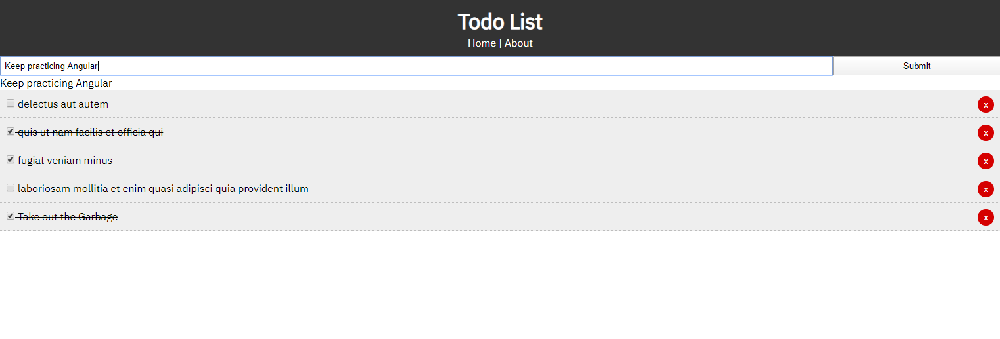

# Todo List

A todo list 📔 created using the Angular framework.

# Screenshot

This project was generated with [Angular CLI](https://github.com/angular/angular-cli) version 8.3.21.

## Demo

[Todo List](https://optimistic-easley-1ec00e.netlify.com/)

## Technology

- Angular v8
- [JSONPlaceholder API](https://jsonplaceholder.typicode.com/)

## Development server

Run `ng serve` for a dev server. Navigate to `http://localhost:4200/`. The app will automatically reload if you change any of the source files.

## Code scaffolding

Run `ng generate component component-name` to generate a new component. You can also use `ng generate directive|pipe|service|class|guard|interface|enum|module`.

## Build

Run `ng build` to build the project. The build artifacts will be stored in the `dist/` directory. Use the `--prod` flag for a production build.

## Running unit tests

Run `ng test` to execute the unit tests via [Karma](https://karma-runner.github.io).

## Running end-to-end tests

Run `ng e2e` to execute the end-to-end tests via [Protractor](http://www.protractortest.org/).

## Further help

To get more help on the Angular CLI use `ng help` or go check out the [Angular CLI README](https://github.com/angular/angular-cli/blob/master/README.md).

# Resource

[Angular Crash Course - Traversy Media](https://www.youtube.com/watch?v=Fdf5aTYRW0E)

## Contact / Social Media

- Twitter – [@seetechnologic](https://twitter.com/seetechnologic)
- GitHub - [https://github.com/JavaVista/](https://github.com/JavaVista/)
- LinkedIn - [Javier Carrion](https://www.linkedin.com/in/technologic)

### License

Distributed under the MIT License. Note: Copyright and license text of third party modules are included in their source code.

